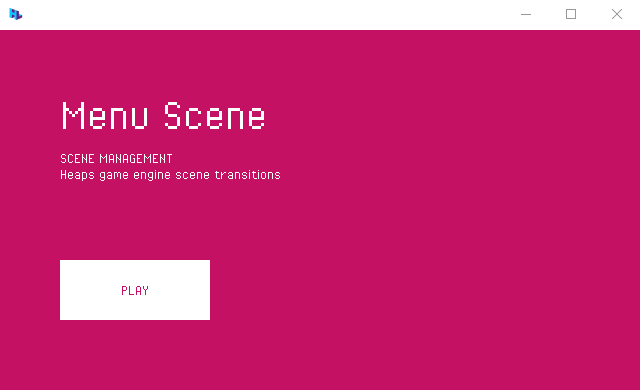

# Haxe + Heaps screen transitions



Simple `sd2.Scene` transitions for Heaps game engine.

Main idea is create scene with bitmap for transition and render it on top of the current scene.

ScreenTransition have protection from multiply clicks/scene creation if transition alredy working. By default current scene mouse events will be removed. New scene events will be locked during transition and unlocked at transition end. 

Transition start with given params: fadeIn/fadeOut time, interval time between them, new `h2d.Scene` instance.

```
transition.change(0.34, 0.17, scene);
```

fadeIn/fadeOut time is tied to `hxd.Timer.wantedFPS`
